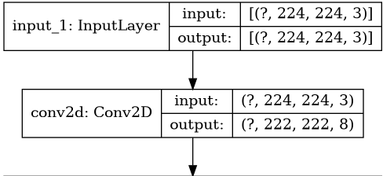
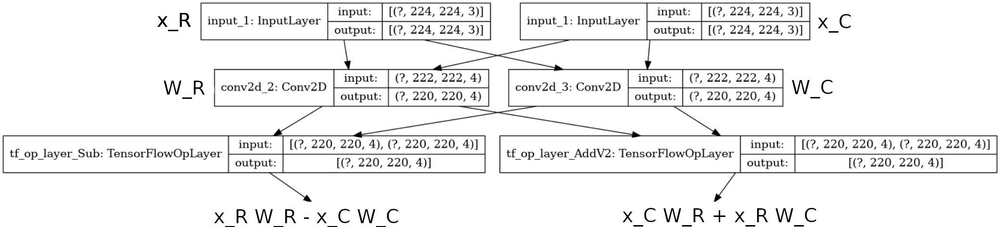
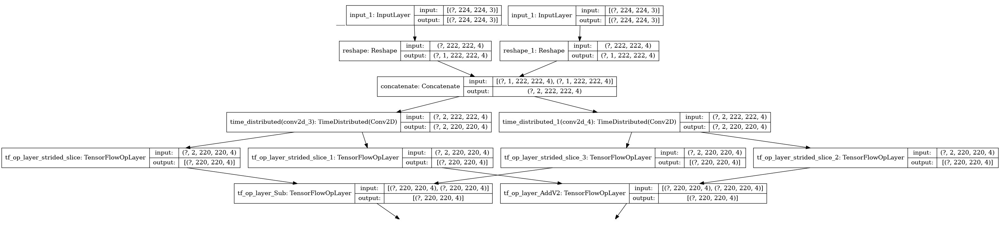
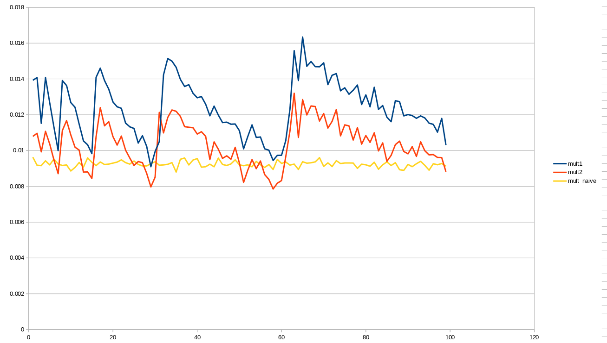

\newpage
# Introduction
This project implements Geometric Algebra (GA) in TensorFlow using Keras high-level API. It is compatible with the latest release of tf 1 ($>=1.13$) and tf $2$.
The goal of this document is to provide all the mathematical explanations and algorithm details to understand the code.

# Linear layer

This section describes how to implement *any* linear layer in TensorFlow, for instance:

  - Conv2D
  - Dense
  - Conv2DTranspose
  - DepthwiseConv2D
  - DepthwiseConv2DTranspose

The idea is to implement a very generic version of a linear layer, valid for any GA and any linear operation. Then all the specific implementations will use this generic implementation.

But first, let's dig deeper into the mathematics to understand how this generic linear layer works.

## On $\mathbb{R}$
For now, lets take a look at linear layers on $\mathbb{R}$. Let:

  - $x$ the row input vector of shape $n$
  - $y$ the row output vector of shape $m$
  - $W$ the linear transformation with $n$ row and $m$ column
  
Then computing this layer means to compute the product : $y = aW$, and in term of Deep Learning, this leads to this simple topology:

{width=40%}


## On $\mathbb{C}$
Now, if we work on complex number, then 

  - $x = x_R + ix_C$
  - $y = y_R + iy_C$
  - $W = W_R + iW_C$
  
Then computing this layer means to compute the product : $y = aW$, or to compute the two products:

  - $y_R = x_RW_R - x_CW_C$
  - $y_C = x_CW_R + x_RW_C$

and in term of Deep learning, this leads to this topology:

{width=100%}

## On any geometical algebra
Now, lets work with generic geometrical algebra, defined by a set of blades $\{\beta_i\}_{i\in[0, n]}$. A blade is a generalization of the concept of scalars and vectors to include multi-vectors. Specifically, a k-blade is any object that can be expressed as the exterior product (or wedge product) of k vectors, and is of grade k. For example, the complex number $x = x_R + ix_C$ can be expressed in terms of blades as $x = x_R\beta_0 + x_C\beta_1$. 

In general, we can then write our 3 elements $x$, $y$ and $W$ as:

  - $x = \sum_{i=0}^{n}x_i\beta_i$
  - $y = \sum_{i=0}^{n}y_i\beta_i$
  - $W = \sum_{i=0}^{n}W_i\beta_i$

Then

$$y = \sum_{i=0}^{n}\sum_{j=0}^{n}x_iW_j\beta_i\beta_j$$

the product $\beta_i\beta_j$ is defined by the structure of the GA and can be expressed as: $\beta_i\beta_j = s\beta_k$ with $k\in[0,n]$ and $s\in\{-1, 0, 1\}$. 
Note that the set of blades $\{\beta_i\}_{i\in[0, n]}$ does not correspond necessarily to an orthonormal set $\{e_i\}_{i\in[0, n]}$. For example, given the orthonormal set $\{e_1, e_2, e_3\}$ in the space $\mathbb{R}^3$, a valid basis for a GA on the same space is $\{1, e_1, e_2, e_3\, e_1 \wedge e_2, e_2 \wedge e_3, e_3 \wedge e_1, e_1 \wedge e_2 \wedge e_3 \}$. We can express this basis in terms of blades as $\{\beta_i\}_{i\in[0, 7]}$, where $\beta_0$ is a 0-blade, $\beta_1, \beta_2, \beta_3$ are 1-blades, $\beta_4, \beta_5, \beta_6$ are 2-blades and $\beta_7$ is a 3-blade.


## Python implementation

No more mathematics, let's code!

First, we need the function that computes the product of two blades: $\beta_i\beta_j = s\beta_k$, i.e. a function that take $(i, j)$ as input and returns $(k, s)$:

```python
# in generic_layers.py
def unit_multiplier(i: int, j: int) -> Tuple[int, int]:
    """given \beta_i and \beta_j, return (k,s) such as : 
       \beta_i * \beta_j = s * \beta_k
    """
```

Now, we need to implement the generic multiplication. To compute $x_jW_i$, we can use directly the native Tensorflow operations. Even better: we do not need to know a priori which linear TensorFlow operation will be used and we can pass this information as an argument. 
So, we define a class `GenericLinear` that implements this formula. We can inherit from this class to define all our linear layers in a very simple way.
For instance, the definition of a Dense layer take only three lines of code: 

```python
class Dense(GenericLinear):
    def __init__(self, *argv, **kwargs):
        super().__init__(tf.keras.layers.Dense, *argv, **kwargs)
```

the `__init__` method of the Dense layer takes exactly the same arguments as the Keras Dense layer, but the `__init__` method of the `GenericLinear` class take one more argument: the Keras class to call (`tf.keras.layers.Dense` here)

The `GenericLinear` class initializes the Keras layer once for every dimension of our GA, and computes all the blade products (and the output) using two `for` loops.

### The bias problem

In deep learning, we often add a bias term after a linear operation. In Keras, this bias is handle by the linear layer itself, which is a problem here.

Indeed, let's have a look at $\mathbb{C}$. If the bias is in the TensorFlow layer:


$$y_R = x_R W_R  - x_C W_C + b_R - b_C$$
$$y_C = x_C W_R  + x_R W_C + b_R + b_C$$

with $(y_R, y_C)$ the output, $(W_R, W_C)$ the linear operation, $(x_R, x_C)$ the input and $(b_R, b_C)$ the bias.

This formulation has two issues:
- the operations are not optimized (we perform two more operations than needed)
- if we only work with one component of the multivector ($o_R$, this happen at the end of the neural network) then we have two variables ($b_R$ and $b_C$) and one constraint. This kind of situation can hurt the performances.

One solution to prevent this is to detect when the user asks for a bias and handle it by hand. The algorithm will be :

- the user sends the parameters to create a linear layer with a bias
- we save the bias parameters and do not forward these to Keras
- Keras creates the linear layer without the bias
- we perform the GA multiplication
- we add at the end the bias with the user's parameters

The easiest way to do it in python is using inspection. 

```python
# convert all arguments from argv to kwargs
parameters = inspect.getfullargspec(layer.__init__).args
for i, arg in enumerate(argv):
    kwargs[parameters[i + 1]] = arg  
    # + 1 because the first element of parameters is 'self'
# add all default parameters to kwargs
for key, value in inspect.signature(layer.__init__).parameters.items():
    if key in ['self', 'kwargs']:
        continue
    if key not in kwargs:
        kwargs[key] = value.default

# If we define some bias, save its parameters
add_bias = False
if "use_bias" in kwargs:
    add_bias = kwargs["use_bias"]
    kwargs["use_bias"] = False
bias_parameters = {}
if add_bias:
    for param in ["bias_initializer", "bias_regularizer", "bias_constraint"]:
        bias_parameters[param] = kwargs[param]
# now we can add the linear layer, then the bias
# ......
```

# Non-linear layers

Examples of non-linear layers are, for instance :

  - MaxPooling2D
  - GlobalAveragePooling2D
  - Reshape
  - BatchNormalization
  - Activation
  - Flatten
  - ZeroPadding2D
  - Add
  - Concatenate

The idea here is again to define a class `GenericNonLinear` that all the non-linear layer inherit. For instance, we want to be able to define an activation function in three lines of code:

```python
class Activation(GenericNonLinear):
    def __init__(self, *argv, **kwargs):
        super().__init__(tf.keras.layers.Activation, *argv, **kwargs)
```

For most of the non-linear layer, the equation is simply:

$$y = \sum_{i=0}^{n}f_i(x_i)\beta_i$$

with

  - $y$ the output
  - $x$ the input
  - $\beta_i$ the blades
  - $f_i$ the non-linear function on $\mathbb{R}$ (for instance $f(x) = max(0, x)$)

The `GenericNonLinear` class initializes the Keras layer once for every dimension of our GA, and when called, computes the output with a simple loop.

## Non-linear layers with multiple inputs

Most of the non-linear layers have only one input, but some can have several (Add and Concatenate).
The implementation is the same, we just need to reorder the inputs before the computation. 
Indeed, these Keras layers take a list of Tensor as input $[T_1, T_2]$.

When working on GA, our input is a list of list of Tensor. The length of the second list 
is the number of components in the GA. For example, when working with quaternion, the input will be
$[[T_{11},T_{12},T_{13},T_{14}], [T_{21},T_{22},T_{23},T_{24}]]$

If we reorder the list this way: $[[T_{11},T_{21}], [T_{12},T_{22}], [T_{13},T_{23}], [T_{14},T_{24}]]$, the rest of the implementation stays valid.

## Exception

### Dropout
When performing dropout, there are several possible strategies: we can cancel weights on the several components of the multivector in a non-correlated or in a correlated way. The current implementation allows for both options:

  - the non-correlated way is the default strategy
  - the correlated way can be achieved if the user defines a random seed when creating the layer. All the Keras layers will have the same seed and therefore the same behavior, as they are called the same number of times.

### BatchNormalization

The current implementation works on the several components of the multivector in a non-correlated way. Maybe in the future we could do something clever ?


# Compatibility with the C++ engine

the C++ engine uses two layers to convert data between TensorFlow and Upstride : `TF2Upstride` and `Upstride2TF`. These two operations are not useful with the python version, but kept for compatibility.

Also, the C++ engine does not define all the layers. For instance, some of the non-linear layers are not implemented.

One fix for now is to link the upstride version with the Keras version at runtime, so it is transparent to the user.
This is implemented in the `imagenet_baseline` repository, as:

```python
import upstride.type3.tf.keras.layers as up_layers
layers_to_register = ['Dropout', ...]
for l in layers_to_register:
    try:
        a = getattr(up_layers, l)
    except AttributeError as e:
        setattr(up_layers, l, getattr(tf.keras.layers, l))
```

So, if a layer is not implemented in the C++ engine, this runtime patch will call the Keras version without compromising the user experience.

# Future improvement
These are some ideas that were not implemented in v0.1:

  - better gradient computation
  - optimize specific implementation (for instance quaternion)
  - improve BatchNormalization

\newpage
# Improvements from v0.1.1 to v0.1.2

## Generic Multiplication
To improve the backpropagation efficiency, a solution is to merge the several gradients before the computation.
TensorFlow provide a way to do this using the TimeDistribute Layer. The idea is to merge the several calls to an operation into one to enable some optimizations. Figure 3 shows the naive version of linear layer

{width=100%}

And figure 4 shows the optimized version

{width=100%}

## Quaternion multiplication

Given two quaternions $u= u_1 +  u_2i +  u_3j +  u_4k$ and $v= v_1 +  v_2i +  v_3j +  v_4k$, the naive way to compute the product $c$ is :

$$
\begin{cases} 
  c_1 = &  u_1 v_1 -  u_2 v_2 -  u_3 v_3 -  u_4 v_4 \\ 
  c_2 = &  u_1 v_2 +  u_2 v_1 +  u_3 v_4 -  u_4 v_3 \\ 
  c_3 = &  u_1 v_3 +  u_3 v_1 +  u_4 v_2 -  u_2 v_4 \\ 
  c_4 = &  u_1 v_4 +  u_4 v_1 +  u_2 v_3 -  u_3 v_2 \\ 
\end{cases}
$$

This computation includes 16 multiplications and 12 additions. 
Due to the isomorphism between $\mathbb{M} \circ \mathbb{G}$ and $\mathbb{G} \circ \mathbb{M}$, this corresponds to 16 calls to the TensorFlow linear layer of choice.

However, there are two more efficient ways of implementing the quaternion multiplication.

### Method 1

$$\begin{pmatrix}−c_0 & c_1 & c_2 & c_3\end{pmatrix}=0.25\begin{pmatrix}n_0p_0 & n_1p_1 & n_2p_2 & n_3p_3\end{pmatrix}A−2\begin{pmatrix} u_0 v_0 &  u_3 v_2 &  u_1 v_3 &  u_2 v_1\end{pmatrix}$$

with 

$$ A = \begin{pmatrix} 1 & 1& 1& 1 \\ 1 & -1 &1&-1\\1&1&-1&-1\\1&-1&-1&1 \end{pmatrix}$$
$$\begin{pmatrix} n_0 & n_1 &n_2 &n_3 \end{pmatrix}= \begin{pmatrix}  u_0 &  u_1 & u_2 & u_3 \end{pmatrix}A $$ 
$$\begin{pmatrix} p_0 & p_1 &p_2 &p_3 \end{pmatrix}= \begin{pmatrix}  v_0 &  v_1 & v_2 & v_3 \end{pmatrix}A $$ 

This formulation requires 40 additions and 8 multiplications (the terms $n_ip_i$ and $u_iv_j$). This corresponds to 8 calls to the TensorFlow linear layer of choice.
For an intuition on the derivation of this formulation, please check this file: https://drive.google.com/file/d/1p8jlvhQqytYeqiMxPlKk6PKJtWeJf-9S/view?usp=sharing

### Method 2

$$
\begin{cases} 
  A_1 = & ( u_4 +  u_2)( v_2 +  v_3) \\
  A_3 = & ( u_1 -  u_3)( v_1 +  v_4) \\
  A_4 = & ( u_1 +  u_3)( v_1 -  v_4) \\
  A_2 = & A_1 + A_3 + A_4 \\
  A_5 = & 0.5(A_2 + ( u_4- u_2)( v_2- v_3)) \\
  c_1 = & A_5 - A_1 + ( u_4 -  u_3)( v_3 -  v_4) \\
  c_2 = & A_5 - A_2 + ( u_2 +  u_1)( v_2 +  v_1) \\
  c_3 = & A_5 - A_3 + ( u_1 -  u_2)( v_3 +  v_4) \\
  c_4 = & A_5 - A_4 + ( u_4 +  u_3)( v_1 -  v_2) \\
\end{cases}
$$

Analogously, this method takes 8 calls to the TensorFlow linear layer corresponding to the multiplications of the form $( u_i -  u_j)( v_k -  v_l)$.

### Comparison implementations

While both Method 1 and Method 2 work well with float32, Method 2 is more stable with float16.

This can be checked using the following code:

```python
import tensorflow as tf
from upstride.type2.tf.keras import utils
distrib = tf.random.uniform
for j in range(1, 100):
  print(j, end=" ")
  i = [distrib((1, 50, 50, 96), maxval=1, dtype=tf.float32) for _ in range(4)]
  k = [distrib((5, 5, 96, 256), maxval=1/(300), dtype=tf.float32) for _ in range(4)]
  def conv_naive(x, y): return utils.quaternion_mult_naive(tf.nn.convolution, x, y)
  def conv1(x, y): return utils.quaternion_mult1(tf.nn.convolution, x, y, j)
  def conv2(x, y): return utils.quaternion_mult2(tf.nn.convolution, x, y, j)
  out_32 = tf.concat(conv_naive(i, k), axis=-1)
  for conv in [conv_naive, conv1, conv2]:
    out_16 = conv(tf.cast(i, tf.float16), tf.cast(k, tf.float16))
    out_16_32 = tf.cast(tf.concat(out_16, axis=-1), tf.float32)
    out = tf.math.reduce_max(tf.abs(out_16_32 - out_32)).numpy()
    print(out, end=' ')
  print()
```

Here we perform three convolutions with the three ways to multiply the quaternion and we plot the result for different multiplicative values for the kernels.

{width=60%}

Method 2 appears to be more stable than Method 1 and is therefore used by default in the engine. 
It is worth noting that $j$ in the code snippet is a scalar that multiplies and divides the kernel values to improve the stability of the computation. Interestingly, depending of the value of $j$, Method 2 can be better than the naive formulation. Investigating the behavior of $j$ can be an interesting project for the future

\newpage
# Improvements from v0.1.2 to v1.0

v1.0 is the first well tested version of the python engine, with many speed and accuracy benchmarks done to be sure where we stand.

The new features are:

- a quaternion version of batch normalization following the idea of https://arxiv.org/pdf/1712.04604.pdf
- a depthwise implementation using the optimized quaternion multiplication. Now there are three optimized linear layer : Conv2D, Dense and DepthwiseConv2D
- MaxNormPooling2D version for quaternion
- improved TF2Upstride for quaternion, with several initializations strategies
- new kernel initialization: `up2_init_he`


## MaxNormPooling2D
To sustain the rotation equivariance property of quaternion algebra, Quaternion MaxNormPooling2D 
is implemented based on this paper (https://arxiv.org/abs/1911.09040) (proof is in the paper). 
The idea is to pick the quaternion which has the largest norm. 

It can be defined as:

$MaxNormPooling2D(f) = \operatorname*{arg\,max}_{f_i} (||f_i||), i = 1, . . . , d$

Here, $d$ is the number of quaternions, from them one quaternion is chosen.

## TF2Upstride
Conversion from TF datatype to UpStride datatype can be done in several ways. This version of the engine includes two new ways of doing this.

### rgbinimg
To create Quaternion multi-vector, the real part is initialized with zeros and thee imaginary parts of $i, j, k$ has been initialized with the $r, g, b$ channels of the input color image.

### learn_multivector
Each component of quaternions can be learned using a small real valued network. This learning module, taken from this paper (https://arxiv.org/pdf/1712.04604.pdf), has the following structure of real valued neural network:

```
    BN --> ReLU --> Conv --> BN --> ReLU --> Conv
```

## Upstride2TF
Conversion from UpStride datatype to real datatype is necessary to calculate the loss. This can be done in several ways. In this version, we add the `concat` option that concatenates all the hyper-complex components to generate the real TensorFlow datatype.

## QInitializer
Proper weight initialization is very important for the convergence of the model. To train a deeper model, it is essential to perform weight initialization in such a way that reduces the risk of exploding or vanishing gradient. Moreover, a hyper-complex model has interactions between components thus we can exploit that interaction that should be taken into account during the initialization. This initialization strategy is described in (https://arxiv.org/pdf/1806.04418.pdf). `up2_init_he` and `up2_init_glorot` can be passed as parameter to initialize weights similar to the the idea of `he` and `glorot` initializations respectively.

# TODO in future version 

## TF2Upstride
- One option could be added where rgb will be in real and other imaginary parts will be learnt using real networks
- Exploring more elaborated network architectures to learn the different components

## Upstride2TF
- Exploit the norm of hyper-complex components
- Different pooling strategy can be explored in the component axis

## RInitializer for Quaternion
- Scaled down version of the real initializer needs to be explored as well. Before QInitializer
we just used the default TF initializer without scaling down their variances to match for quaternion.
This needs to be done to explore the effectiveness of QInitializer.


# Improvements for v2
Big refractor of the code to match the data structure define in Phoenix project :
- Now only support channel first
- Images have shape [Batch_size * N_dim, C, H, W]
- Conv kernels have shape [N_dim, O, I, H, W]
- Depthwise conv kernels have shape [N_dim, depth_mul * I, 1, H, W]
- Dense layer kernels have shape [N_dim, I, O]
- QInitializer is now HInitializer