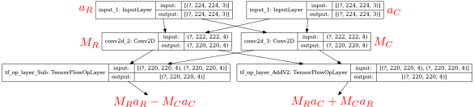

\newpage
# Introduction
This project implements Geometric Algebra (GA) in TensorFlow using Keras high-level API. It is compatible with latest release of tf 1 ($>=1.13$) and tf $2$.

This document explains how to implement Geometric Algebra using TensorFlow. Its goal is to provide all the mathematical explanations and algorithm details to understand 
how the code is written. 

# Linear layer

This section describes how to implement *any* linear layer in TensorFlow, for instance:

  - Conv2D
  - Dense
  - Conv2DTranspose
  - DepthwiseConv2D
  - DepthwiseConv2DTranspose

The idea is to implement a very generic version of linear layer, valid for any GA and any linear operation. Then all the specific implementations will use this generic implementation.

But first, let's dig deeper into the mathematics to understand how linear layer works.

## On $\mathbb{R}$
For now, lets take a look at linear layers on $\mathbb{R}$. Let:

  - $a$ the input vector of shape $n$
  - $b$ the output vector of shape $m$
  - $M$ the linear transformation with $n$ row and $m$ column
  
Then computing this layer means to compute the product : $b = aM$, and in term of Deep Learning, this leads to this simple topology:

{width=40%}


## On $\mathbb{C}$
Now, if we work on complex number, then 

  - $a = a_R + ia_C$
  - $b = b_R + ib_C$
  - $M = M_R + iM_C$
  
Then computing this layer means to compute the product : $b = aM$, or to compute the two products:

  - $b_R = a_RM_R - a_CM_C$
  - $b_C = a_CM_R + a_RM_C$

and in term of Deep learning, this leads to this topology:

{width=100%}

## On any geometical algebra
Now, lets work with generic geometrical algebra, defined by a set of blades $(e_i)_{i\in[0, n]}$ that can be scalars, vectors, bi-vectors or multi-vectors. We can then write our 3 elements $a$, $b$
and $M$ as:

  - $a = \sum_{i=0}^{n}a_ie_i$
  - $b = \sum_{i=0}^{n}b_ie_i$
  - $M = \sum_{i=0}^{n}M_ie_i$

Then

$$b = \sum_{i=0}^{n}\sum_{j=0}^{n}a_jM_ie_ie_j$$

the product $e_ie_j$ is defined by the structure of the GA, but in orthogonal cases, it gives : $e_ie_j = se_k$ with $k\in[0,n]$ and $s\in\{-1, 0, 1\}$

This formula allows us to implement all linear layer for all geometrical algebra at the same time.

## Python implementation

No more mathematics. Now we can code!

so first, we need this function that compute the product of two blades: $e_ie_j = se_k$. It means we need to have a function that take $(i, j)$ as input and returns $(k, s)$:

```python
# in generic_layers.py
def unit_multiplier(i: int, j: int) -> Tuple[int, int]:
    """given e_i and e_j, return (k,s) such as : e_i * e_j = s * e_k
    """
```

Now we need to implement the generic multiplication. In the formula, we saw that inside the double sum, it performs an operation on $\mathbb{R}$, so
we can use the TensorFlow operation to implement our own. And even better, we don't need to know which TensorFlow operation will be used, so we can implement the formula once and then call it by specifying the TensorFlow operation to use.

So we defined a class `GenericLinear` that will implement this formula. We will be able to inherit from this class to easily define all our linear layers in a very simple way.
For instance, the definition of a Dense layer take only 3 lines of code: 

```python
class Dense(GenericLinear):
    def __init__(self, *argv, **kwargs):
        super().__init__(tf.keras.layers.Dense, *argv, **kwargs)
```

the `__init__` method of the Dense layer takes exactly the same arguments as the Keras Dense layer, but 
the `__init__` method of the `GenericLinear` class take one more argument: the Keras class to call (`tf.keras.layers.Dense` here)

the `GenericLinear` class initialize the Keras layer once for every dimension of our GA, and then, when called, 2 `for` loops compute all the products between
all the blade to compute the output.

### The bias problem

In deep learning, we often add a bias term after a linear layer. In Keras, this bias is handle by the linear layer, which is a problem here.

Indeed, let's have a look at $\mathbb{C}$. If the bias is in the linear layer then the operation we do are:


$$o_R = a_R M_R  - a_C M_C + b_R - b_C$$
$$o_C = a_C M_R  + a_R M_C + b_R + b_C$$

with $(o_R, o_C)$ the output, $(M_R, M_C)$ the linear operation, $(a_R, a_C)$ the input and $(b_R, b_C)$ the bias.

From the mathematical formula, we see that we have 2 issues: 

- the operations are not optimized (we perform 2 more operations than needed)
- if we only work with one component of the multivector ($o_R$, this happen at the end of the neural network) then we have two variables ($b_R$ and $b_C$) and one constraint. This kind of situation can hurt the performances.

One solution to prevent this to detect when the user ask for a bias and handle it by hand. The algorithm will be :

- the user send the parameters to create a linear layer with a bias
- we save the bias parameters and do not forward these to Keras
- Keras create the linear layer without the bias
- we perform the GA multiplication
- we add at the end the bias with the user's parameters

The easiest way to do it in python is using inspection. 

```python
# convert all arguments from argv to kwargs
parameters = inspect.getfullargspec(layer.__init__).args
for i, arg in enumerate(argv):
    kwargs[parameters[i + 1]] = arg  
    # + 1 because the first element of parameters is 'self'
# add all default parameters to kwargs
for key, value in inspect.signature(layer.__init__).parameters.items():
    if key in ['self', 'kwargs']:
        continue
    if key not in kwargs:
        kwargs[key] = value.default

# If we define some bias, save its parameters
add_bias = False
if "use_bias" in kwargs:
    add_bias = kwargs["use_bias"]
    kwargs["use_bias"] = False
bias_parameters = {}
if add_bias:
    for param in ["bias_initializer", "bias_regularizer", "bias_constraint"]:
        bias_parameters[param] = kwargs[param]
# now we can add the linear layer, then the bias
# ......
```

# Non-linear layers

non linear layers are for instance :

  - MaxPooling2D
  - GlobalAveragePooling2D
  - Reshape
  - BatchNormalization
  - Activation
  - Flatten
  - ZeroPadding2D
  - Add
  - Concatenate

The idea here is again to define a class `GenericNonLinear` that we will be able to inherit to define most of our non-linear layer
the same way we did for  our linear layer. For instance, we want to be able to define an activation function in 3 lines of code:

```python
class Activation(GenericNonLinear):
    def __init__(self, *argv, **kwargs):
        super().__init__(tf.keras.layers.Activation, *argv, **kwargs)
```

For most of the non-linear layer, the equation is simply:

$$o = \sum_{i=0}^{n}f_i(a_i)e_i$$

with

  - $o$ the output
  - $a$ the input
  - $e_i$ the blades
  - $f_i$ the non-linear function on $\mathbb{R}$ (for instance $f(x) = max(0, x)$)

the `GenericNonLinear` class initialize the Keras layer once for every dimension of our GA, and when called, compute the output with a simple loop.

## Non-linear with many inputs

most of the non-linear layers have only one input, but some can have several (Add and Concatenate).
The implementation is the same, we just need to reorder the inputs before computation. 
Indeed, these Keras layers takes a list of Tensor as input $[T_1, T_2]$.

When working on GA, or input is a list of list of Tensor. The length of the second list 
is the number of component in the GA, so if working with quaternion, the input will be
$[[T_{11},T_{12},T_{13},T_{14}], [T_{21},T_{22},T_{23},T_{24}]]$

If we reorder the list this way: $[[T_{11},T_{21}], [T_{12},T_{22}], [T_{13},T_{23}], [T_{14},T_{24}]]$
, the rest of the implementation stays valid

## Exception

### Dropout
When performing dropout, there are several possible strategies: we can cancel weights on the several components of the multivector in a non-correlated way
or a correlated way. The current implementation can be both:

  - the non-correlated way is the default strategy
  - correlated way can be achieved if the user define a random seed when creating the layer. All the Keras layers will have the same seed and so the
  same behavior,as they are called the same number of time.

### BatchNormalization

The current implementation works on the several component of the multivector in a non-correlated way. Maybe in the future we could do something clever ?


# Compatibility with the C++ engine

the C++ engine uses 2 layers to convert data between TensorFlow and Upstride : `TF2Upstride` and `Upstride2TF`
these 2 operations are not useful with the python version but kept for compatibility.

Also the C++ engine doesn't define all the layers : some of the non linear for instance don't
need to be implemented. But we need them for the python version.

One fix for now is to link the upstride version with the Keras version at runtime, so it is transparent to the user.
This is implemented in the `imagenet_baseline` repository

```python
import upstride.type3.tf.keras.layers as up_layers
layers_to_register = ['Dropout', ...]
for l in layers_to_register:
    try:
        a = getattr(up_layers, l)
    except AttributeError as e:
        setattr(up_layers, l, getattr(tf.keras.layers, l))
```

so if a layer is not implemented in the C++ engine, this runtime patch will allow the user to call the Keras version without having to take care of this.

# Future improvement
This are some idea of things we could do in the future that wasn't done in v0.1

  - better gradient computation
  - optimize specific implementation (for instance quaternion)
  - improve BatchNormalization

\newpage
# Improvements from v0.1.1 to v0.1.2

## Generic Multiplication
To improve the backpropagation efficiency, a solution is to merge the several gradients before it computation.
TensorFlow provide a way to do it using the TimeDistribute Layer. The idea is to merge the several calls to an operation into one to enable some optimizations. Figure 3 shows the naive version of linear layer

{width=100%}

And figure 4 shows the optimized version

{width=100%}

## Quaternion multiplication

Given 2 quaternions $(a_1 + a_2i + a_3j + a_4k)$ and $(b_1 + b_2i + b_3j + b_4k)$, the naive way to compute the product $c$ is :

$$
\begin{cases} 
  c_1 = & a_1b_1 - a_2b_2 - a_3b_3 - a_4b_4 \\ 
  c_2 = & a_1b_2 + a_2b_1 + a_3b_4 - a_4b_3 \\ 
  c_3 = & a_1b_3 + a_3b_1 + a_4b_2 - a_2b_4 \\ 
  c_4 = & a_1b_4 + a_4b_1 + a_2b_3 - a_3b_2 \\ 
\end{cases}
$$

So 16 multiplications and 12 additions.

In term of tensorflow operations, because of the isomorphism between $\mathbb{M} \circ \mathbb{G}$ and $\mathbb{G} \circ \mathbb{M}$, it means for implementing a linear layer on $\mathbb{H}$, it takes 16 calls to the linear layer on $\mathbb{R}$.

However, a quaternion multiplication can also be implemented this way: 

$$\begin{pmatrix} n_0 & n_1 &n_2 &n_3 \end{pmatrix}= \begin{pmatrix} a_0 & a_1 &a_2 &a_3 \end{pmatrix}A $$ 
$$\begin{pmatrix} p_0 & p_1 &p_2 &p_3 \end{pmatrix}= \begin{pmatrix} b_0 & b_1 &b_2 &b_3 \end{pmatrix}A $$ 

$$\begin{pmatrix}−c_0 & c_1 & c_2 & c_3\end{pmatrix}=0.25\begin{pmatrix}n_0p_0 & n_1p_1 & n_2p_2 & n_3p_3\end{pmatrix}A−2\begin{pmatrix}a_0b_0 & a_3b_2 & a_2b_1 & a_1b_3\end{pmatrix}$$

with 

$$ A = \begin{pmatrix} 1 & 1& 1& 1 \\ 1 & -1 &1&-1\\1&1&-1&-1\\1&-1&-1&1 \end{pmatrix}$$

We will call this method 1. 40 additions and 8 multiplications are needed, so for implementing a linear layer, 8 calls to the linear layer on $\mathbb{R}$ are needed, which is way better.

Another method is to compute :

$$
\begin{cases} 
  A_1 = & (a_4 + a_2)(b_2 + b_3) \\
  A_3 = & (a_1 - a_3)(b_1 + b_4) \\
  A_4 = & (a_1 + a_3)(b_1 - b_4) \\
  A_2 = & A_1 + A_3 + A_4 \\
  A_5 = & 0.5(A_2 + (a_4-a_2)(b_2-b_3)) \\
  c_1 = & A_5 - A_1 + (a_4 - a_3)(b_3 - b_4) \\
  c_2 = & A_5 - A_2 + (a_2 + a_1)(b_2 + b_1) \\
  c_3 = & A_5 - A_3 + (a_1 - a_2)(b_3 + b_4) \\
  c_4 = & A_5 - A_4 + (a_4 + a_3)(b_1 - b_2) \\
\end{cases}
$$

This method takes also 8 calls to the linear layer on $\mathbb{R}$ to implement the layer on $\mathbb{H}$.

After implementing these methods, we found that they work very well when working with float 32, but not in float 16 for alexnet models.

After checking the errors of the differents layers when working in float 16, we found that the second implementation is more stable then the first one.

This can be checked using the following code:

```python
import tensorflow as tf
from upstride.type2.tf.keras import utils
distrib = tf.random.uniform
for j in range(1, 100):
  print(j, end=" ")
  i = [distrib((1, 50, 50, 96), maxval=1, dtype=tf.float32) for _ in range(4)]
  k = [distrib((5, 5, 96, 256), maxval=1/(300), dtype=tf.float32) for _ in range(4)]
  def conv_naive(x, y): return utils.quaternion_mult_naive(tf.nn.convolution, x, y)
  def conv1(x, y): return utils.quaternion_mult1(tf.nn.convolution, x, y, j)
  def conv2(x, y): return utils.quaternion_mult2(tf.nn.convolution, x, y, j)
  out_32 = tf.concat(conv_naive(i, k), axis=-1)
  for conv in [conv_naive, conv1, conv2]:
    out_16 = conv(tf.cast(i, tf.float16), tf.cast(k, tf.float16))
    out_16_32 = tf.cast(tf.concat(out_16, axis=-1), tf.float32)
    out = tf.math.reduce_max(tf.abs(out_16_32 - out_32)).numpy()
    print(out, end=' ')
  print()
```

Here we perform 3 convolutions with the 3 ways to multiply the quaternion and we plot the result for different multiplicative values for the kernels
If seems the second algorithm is more stable than the first one, and more interesting, depending of the value of j, it is sometime better than the
naive version.

So now, the engine use by default quaternion_mult2 with j=1. Investigating the behavior of $j$ can be an interesting project for the future

{width=60%}

\newpage
# Improvements from v0.1.2 to v1.0

v1.0 is the first well tested version of the python engine, with many speed and accuracy benchmarks done to be sure where we stand.

The new features are:

- a quaternion version of batch normalization following the idea of https://arxiv.org/pdf/1712.04604.pdf
- a depthwise implementation using the optimized quaternion multiplication. How there are 3 optimized linear layer : Conv2D, Dense and DepthwiseConv2D
- MaxNormPooling2D version for quaternion (TODO Rifat : add comments)
- improved TF2Upstride for quaternion, with several initializations strategies (TODO Rifat : add comments)
- new kernel initialization: `up2_init_he` (TODO Rifat : add comments)


## MaxNormPooling2D
To sustain the rotation equivariance property of quaternion algebra, Quaternion MaxNormPooling2D 
is implemented based on this paper (https://arxiv.org/abs/1911.09040) (proof is in the paper). 
The idea is to pick the quaternion which has the largest norm. 

It can be defined as:

$MaxNormPooling2D(f) = \operatorname*{arg\,max}_{f_i} (||f_i||), i = 1, . . . , d$

Here, $d$ is the number of quaternions, from them one quaternion is chosen.

## TF2Upstride
Conversion from TF datatype to UpStride datatype can be done in several ways. In this version of the engine, 
two of them are added. Following two can be passed as a parameter to TF2Upstride layer:

### rgbinimg
To create Quaternion multi-vector, real part is initialized with zeros and thee imaginary parts of 
$i, j, k$ has been initialized with $r, g, b$ channels of rgb image respectively.

### learn_multivector
Each component of quaternions can be learned using a small real valued network. This learning module taken from 
this paper (https://arxiv.org/pdf/1712.04604.pdf) which has the following structure of real valued neural network.

```
    BN --> ReLU --> Conv --> BN --> ReLU --> Conv
```

## Upstride2TF
Conversion from UpStride datatype to real datatype is necessary to calculate the loss. This can be done in several ways. 
In this version we added the 'concat' option.

### concat
It concatenates all the hyper-complex components to make the real (TF) datatype

## QInitializer
Proper weight initialization is very important for the convergence of the model. To train a deeper model
it is essential to make weight initialization in such a way that reduces the risk of exploding or
vanishing gradient problem. Moreover, a hyper-complex model has interactions between components thus we can exploit that interaction
during the initialization. This initialization strategy is described in (https://arxiv.org/pdf/1806.04418.pdf)

# TODO in future Version 

## TF2Upstride
- One option could be added where rgb will be in real and other imaginary parts will be learnt from the 
rgb using real networks
- For learning the components some complex real networks can be explored

## Upstride2TF
- Norm of hyper-complex components should be explored
- Different pooling strategy can be explored in the component axis

## RInitializer for Quaternion
- Scaled down version of the real initializer needs to be explored as well. Before QInitializer
we just used the default TF initializer without scaling down their variances to match for quaternion.
This needs to be done to explore the effectiveness of QInitializer.
